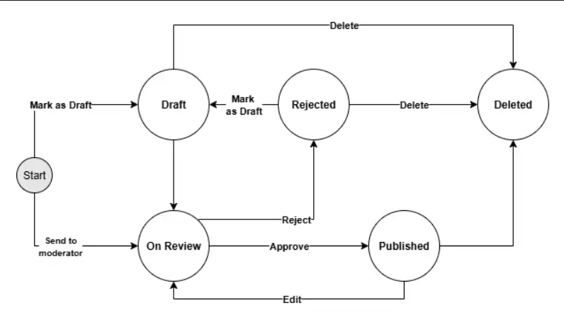
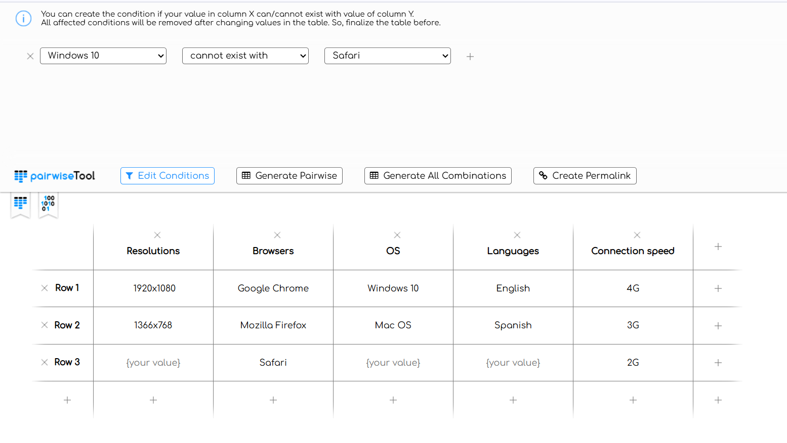
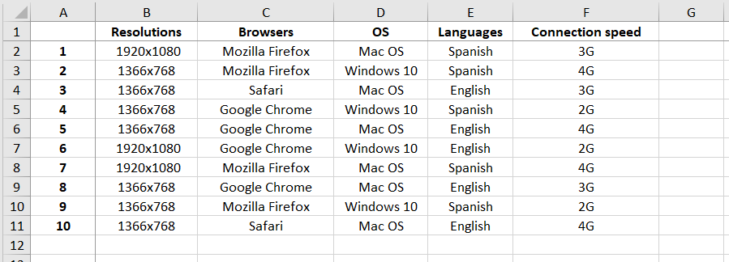

# Test Design Techniques  

Test design is a core QA skill: it turns vague requirements into focused, high-value tests.

## About this document
This document compiles short tasks and my solutions using different test design techniques. Each task shows how I translate requirements into precise, reusable tests.

## Shortcuts
- [Equivalence Classes](https://github.com/Roksolana-K/qa-portfolio/edit/main/test-design-techniques/README.md#%EF%B8%8F-equivalence-classes)
- [Boundary Values Practice](https://github.com/Roksolana-K/qa-portfolio/edit/main/test-design-techniques/README.md#%EF%B8%8F-boundary-values-practice)
- [Decision Table](https://github.com/Roksolana-K/qa-portfolio/edit/main/test-design-techniques/README.md#%EF%B8%8F-decision-table)
- [State Diagram](https://github.com/Roksolana-K/qa-portfolio/edit/main/test-design-techniques/README.md#%EF%B8%8F-state-diagram)
- [Pairwise Technique](https://github.com/Roksolana-K/qa-portfolio/edit/main/test-design-techniques/README.md#%EF%B8%8F-parwise)

---

## ✏️ Equivalence Classes

### Task
Write the **equivalence classes** for the requirements:

- RQ-01: Password length must be a **minimum of 4** characters  
- RQ-02: Password length must be a **maximum of 16** characters  
- RQ-03: The password must contain **at least one uppercase** letter  
- RQ-04: The password must contain **at least one special** character

### Answer

| # | Equivalence class | Test input example | Expected result |
|---|-------------------|--------------------|-----------------|
| 1 | 0-3, upper case + 1 special char | `Pa!` | **Rejected**: too short |
| 2 | 4-16, upper case + 1 special char | `!Password` | **Accepted** |
| 3 | 16+, upper case + 1 special char | `!SuperDuperPassword` | **Rejected**: too long |
| 4 | 4-16, WITHOUT upper case + 1 special char | `!password` | **Rejected**: missing uppercase |
| 5 | 4-16, upper case + WITHOUT special char | `Password` | **Rejected**: missing special character |

---

## ✏️ Boundary Values Practice   

### Task
Write **boundary values** for:

- RQ-01: Password length **minimum 4**
- RQ-02: Password length **maximum 16**

### Answer

| # | Boundary value | Test input example | Expected result |
|---|----------------|--------------------|-----------------|
| 1 | Min − 1 = 3 chars | `Pa!` | **Rejected**: too short |
| 2 | Min = 4 chars | `Pass` | **Accepted** |
| 3 | Min + 1 = 5 chars | `Pass1` | **Accepted** |
| 4 | Max − 1 = 15 chars | `SuperPassword1!` | **Accepted** |
| 5 | Max = 16 chars | `#SuperPassword1!` | **Accepted** |
| 6 | Max + 1 = 17 chars | `##SupeerPassword1!` | **Rejected**: too long |

---

## ✏️ Decision Table
### Task 
1. Login to the **Conduit** app.
2. Open the page with the “New Article” form and observe the form.
3. There are 3 required fields in this form "Article title", "What's this article about" and "Write your article" which means the article cannot be submitted without these fields filled up.
4. There is 1 optional field “Enter tags” - which means an article can be submitted even without this field filled up.
5. Look at the table and fill it with:
    - "True" - means the field is filled up.
    - "False" - means the field is not filled up.
    - "PA" - means the article should be published.
    - "ER" - means an error message should be shown and an article should not be published.
6. After, look at the obtained table. Think about which cases are redundant.

### Answer

|                         | TC1 | TC2  | TC3  | TC4  | TC5  | TC6  | TC7  | TC8  | TC9  | TC10 | TC11 | TC12 | TC13 | TC14 | TC15 | TC16 |
|-------------------------|:---:|:----:|:----:|:----:|:----:|:----:|:----:|:----:|:----:|:----:|:----:|:----:|:----:|:----:|:----:|:----:|
| **Article title***      | TRUE| FALSE| TRUE | TRUE | TRUE | FALSE| TRUE | TRUE | FALSE| FALSE| TRUE | FALSE| FALSE| FALSE| TRUE | FALSE|
| **What’s this article about*** | TRUE| TRUE | FALSE| TRUE | TRUE | FALSE| FALSE| TRUE | TRUE | TRUE | FALSE| FALSE| FALSE| TRUE | FALSE| FALSE|
| **Write your article*** | TRUE| TRUE | TRUE | FALSE| TRUE | TRUE | FALSE| FALSE| TRUE | FALSE| TRUE | FALSE| TRUE | FALSE| FALSE| FALSE|
| **Enter tags**          | TRUE| TRUE | TRUE | TRUE | FALSE| TRUE | TRUE | FALSE| FALSE| TRUE | FALSE| TRUE | FALSE| FALSE| FALSE| FALSE|
| **Expected result**     | **PA** | **ER** | **ER** | **ER** | **PA** | **ER** | **ER** | **ER** | **ER** | **ER** | **ER** | **ER** | **ER** | **ER** | **ER** | **ER** |

\* Required fields

> In real life, we do not need to run all 16 test cases. We can skip most of them without losing the test coverage.  
After analyzing the table, I reached to the conclusion that **the most important are TC1 and TC5 because they cover the normal publish flow**: all required fields are filled, once with tags and once without tags (proving that tags are optional).   
**Next in priority are TC2, TC3, and TC4. These check each required field separately.**
This set fully covers the rules: all three required fields must be present, and tags are optional.    
Also, I think that **if needed, you can add TC16** (everything empty) to confirm the form blocks submission when nothing is filled.

---

## ✏️ State Diagram
### Task
 Analyze the requirements and create a **State Transtion Diagram** for testing the Article creating:  
  - **RQ-001**. All users should be able to create an article on the site. 
  - **RQ-002**. The Conduit has the following Pages for working with Articles:  
    - The _“Create a new Article”_ page - contains the article creation form. 
    - The _“Drafts”_ page - contains all the articles not completed by the user. 
    - The _“My articles”_ page - contains all articles of the user that were sent to the moderator review. The page contains the following tabs:
      - _Published_ - reviewed by the moderator and published articles. 
      - _Rejected_ - articles rejected by a moderator after the review. 
      - _On_ Review - articles to review for moderator. 
    - The _“Deleted”_ page - all articles deleted by the user.
- **RQ-003**. The flow of the work with an Article:
    1. To create an Article, the user should go to the form “Create a new Article” and fill in all required fields. After that, a user should be able to send an article to the Draft or On Review to a moderator.
    2. An article in the On Review status can be Published or Rejected by a moderator.
    3. A Published article can be Deleted or sent to On Review after the changes from the author.
    4. A Rejected article can be sent to Draft or Deleted.
    5. From the Draft, an article can be sent to On Review or Deleted.
    6. Deleted articles can’t be restored.

### Answer

## ✏️ Parwise Technique
### Task
Create a **pairwise table** which will cover the next input parameters for testing:
  - Resolutions: 1920x1080, 1366x768;
  - Browsers: latest version of Google Chrome, Mozilla Firefox, Safari;
  - OS: Windows 10, Mac OS;
  - Languages: English, Spanish;
  - Connection speed: 4G, 3G, 2G.

**Use [Pairwise combiner app](https://pairwise.teremokgames.com/).**   
**Don't forget:** Think which combinations are not possible, or are very unlikely.

### Answer

**Results:**   

